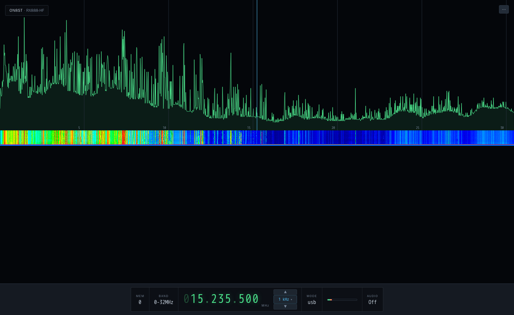
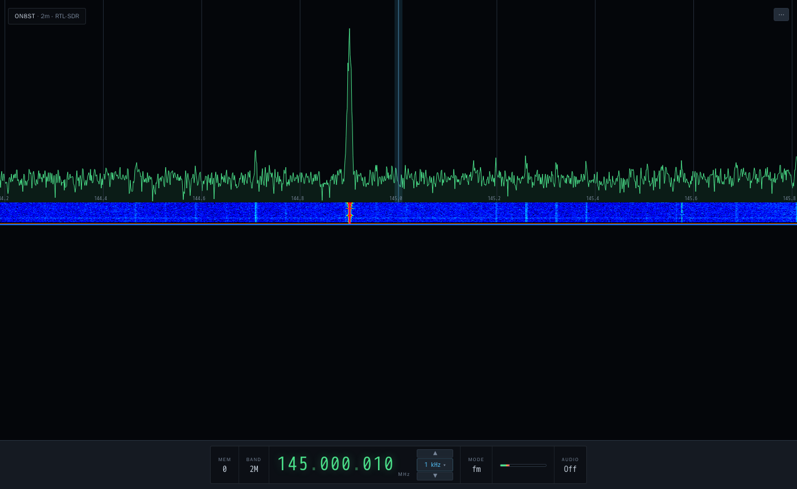
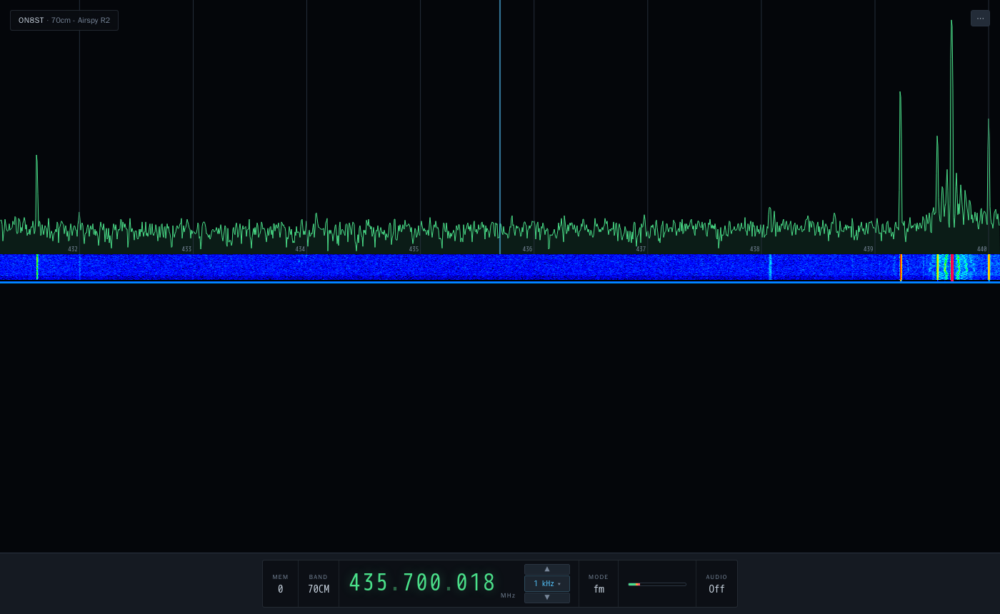

# Volunteering an alternate instrument UI upstream

Hi Wayne,

I run a multi-band amateur station (ON8ST, Belgium) built on `ka9q-radio`,
covering HF (RX888), VHF (RTL-SDR, 2m) and UHF (Airspy R2, 70cm), with
UberSDR and `ka9q-web` both running as front ends. Full details on the
setup are on my shack server: https://shack.on8st.be/. `ka9q-web`'s
support for non-zero-centred (tuner-based) front ends needed a fair
amount of work to get right for VHF/UHF specifically - happy to open a
separate PR for those server-side fixes if useful, independent of
everything below.

The main reason I'm writing: I built a second, alternate front-end UI for
`ka9q-web` - a from-scratch "instrument" style interface (single scope
canvas, segment+popover controls, mobile-responsive) that I ended up
liking enough to make my station's default landing page, with the stock
UI kept alongside for reference. In principle, most of the existing
controls have been implemented for backward compatibility - feature
parity with stock is mechanically checked, not just claimed - plus a few
things stock doesn't have (band-edge markers, mode-by-frequency, a live
status drawer). Some polishing is probably still needed here and there,
but it's solid enough day-to-day that I've been running on it myself.

I'd like to volunteer it back upstream if you're interested - not
assuming you want a second bundled UI, just offering.

## Screenshots

HF:

VHF:

UHF:

## Live right now

- https://sdr-hf.on8st.be/
- https://sdr-vhf.on8st.be/
- https://sdr-uhf.on8st.be/

(stock UI is still there too, at `/legacy/radio.html` on each)

Source: https://github.com/on8st/ka9q-web, branch `on8st-vhf-uhf`.

No pressure either way - let me know if this is something you'd want, and
if so how you'd want it structured (subdirectory, opt-in flag, separate
repo, whatever fits your project best).

73,
on8st-stan
